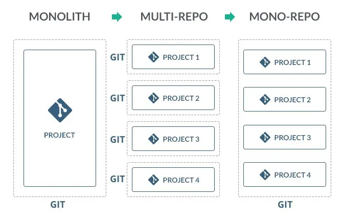

# Buildyy: A Comprehensive Build Automation Tool

Buildyy is a robust build automation tool designed to manage and automate the building, versioning, changelog generation, and Docker image creation for multi-repo or multi-sub-project environments. This tool is particularly useful for projects consisting of several interconnected sub-projects, each with its own lifecycle and dependencies. Written in Go, Buildyy offers a high-performance, user-friendly, and scalable solution for complex build processes.

## Features

- **Centralized Configuration**: Manage all sub-project settings from a single YAML configuration file (`build-config.yaml`).
- **Independent Versioning**: Use semantic versioning for each sub-project independently.
- **Changelog Generation**: Automatically generate changelogs based on commit messages or specified formats.
- **Build Automation**: Execute specific build commands for each sub-project, handling dependencies and build order.
- **Docker Support**: Build and tag Docker images for sub-projects specifying a Dockerfile.
- **Tagging and Git Integration**: Automatically tag releases in Git and push them to the repository.
- **CLI Support**: Interact with the build system through a comprehensive CLI.

## Installation

Ensure that you have Go installed on your system. You can download and install Go from [the official site](https://golang.org/dl/).

To install Buildyy, clone the repository and build the binary using the following commands:

```bash
git clone https://github.com/Amrrx/buildyy.git
cd Buildyy
go build -o Buildyy
```

## Configuration

Create a `build-config.yaml` in your project's root directory. Here is an example of how the configuration might look:

```yaml
version: 1.0
subprojects:
  - name: "SubProjectA"
    version: "1.0.0"
    path: "./SubProjectA"
    build_commands:
      - "go build -o outputA"
    dockerfile: "Dockerfile"
    dependencies: ["SubProjectB"]
  - name: "SubProjectB"
    version: "0.9.0"
    path: "./SubProjectB"
    build_commands:
      - "go build -o outputB"
```

## Usage

### Basic Commands

- **Initialize Configuration**: Set up a new `build-config.yaml` template.
  ```bash
  ./Buildyy init
  ```
- **Build Projects**: Build one or all sub-projects.
  ```bash
  ./Buildyy build --all
  ./Buildyy build --project SubProjectA
  ```
- **Version Management**: Increment the version of a sub-project.
  ```bash
  ./Buildyy version --project SubProjectA --bump minor
  ```
- **Generate Changelog**: Update the changelog for a sub-project.
  ```bash
  ./Buildyy changelog --project SubProjectA
  ```

### Docker and Tagging (Coming Soon)

Docker image creation and tagging are in development. Future versions will allow you to:

- Build Docker images based on project-specific Dockerfiles.
- Tag and push images to Docker registries.

## Reporting and Logging

Buildyy automatically logs build processes and errors. Logs and reports can be found in the `logs` directory within your project after running build commands.

## Contributing

Contributions are welcome! Please fork the repository and submit pull requests with your proposed changes.

## License

Distributed under the MIT License. See `LICENSE` for more information.

---

For more information or to report issues, visit [the project repository](https://github.com/Amrrx/buildyy/issues).
```

